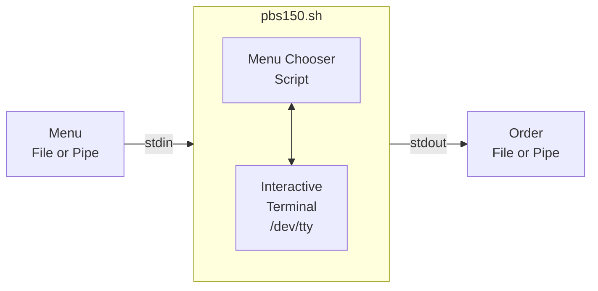

# Frank's PBS Bash Challenges
## PBS 150

### Design

I interpret the challenge to mean we need to handle a command line like this

```bash
cat menu.txt | pbs150.sh -m - > order.txt
```
Previously, the script will read the user input choices from STDIN and output to STDOUT.
Now however, STDIN is going to supply the menu file, not the user input when selecting items.
And we don't want the `select` dialog to go into the final order file.
STDOUT is going to be used for the final order, not the `select` promts to the user.
We need a way to read interactively from the user terminal while STDIN and STDOUT are used for other things.




It turns out that the file /dev/tty (for teletype) is a special file which is connected to the terminal which started the process. So we will try using the select loop by redirecting the input and output from /dev/tty for the select loop only

